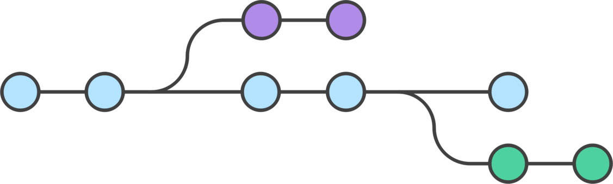

# **Ветки и коммиты**

Коммит — это основной объект в управлении контроля версий. Он содержит все изменения за время этого коммита. Коммиты связаны между с собой как односвязный список. 

Ветка в Git — это просто «скользящий» указатель на один из коммитов. Когда вы создаёте новые коммиты, указатель ветки автоматически сдвигается вперёд, к вновь созданному коммиту.

---
Ветка с коммитами

---
Представим код проекта в виде дерева. Посередине ствол - это рабочее состояние проекта, тот код, который выложен на боевом сервере. Этот ствол в терминах git называется основной веткой разработки - веткой master. Эта ветка есть всегда в любом проекте. Как только мы клонировали или создали новый репозиторий, мы попали в ветку master.

Когда мы начинаем работать над новым функционалом, мы создаем новую ветку на основе master. После этого мы можем работать, создавать новые файлы, вносить изменения в старые, можем хоть удалить половину проекта - главное, что это будет изолировано от основного мастера. То есть в своей ветке мы можем как угодно ломать проект, основной код при этом не пострадает. 

Так как git хранит всю историю проекта, то он хранит все коммиты всех веток и со всеми изменениями. То есть вернувшись в свою ветку мы увидим уже сделанные коммиты и можем посмотреть изменения по ним. 

Когда мы заканчиваем работать над новым функционалом, то нужно наши изменения перенести в мастер, чтобы залить на боевой сайт. Это называется залить в ветку мастер.

[Полезные команды](./command.md)

---
[<<< Перейти к содержанию](./01_readme.md) / [Далее >>>](./10_gitignore.md)