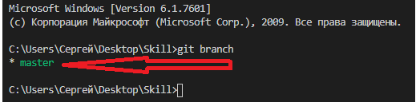

# **Основные команды** 

---

_Чтобы упростить процесс обучения, я собрал для вас все самые необходимые команды, которые пригодятся в работе с Git на первое время._
---

+ <code>git diff</code>

Команда выводит изменения в файлах, которые еще не были добавлены в индекс.

- `git clone`

Команда git clone используется для клонирования репозитория.

* ``git branch``

Команда git branch — это своего рода “менеджер веток”. Она умеет перечислять ваши ветки, создавать новые, удалять и переименовывать их.

+ `git log`

Команда git log используется для просмотра истории коммитов, начиная с самого свежего и уходя к истокам проекта.

- `git clean`

Команда git clean используется для удаления мусора из рабочей директории. Это могут быть результаты сборки проекта или файлы конфликтов слияний.

* `git reset`

Команда git reset, как можно догадаться из названия, используется в основном для отмены изменений.

+ `git checkout`

Команда git checkout используется для переключения веток и выгрузки их содержимого в рабочую директорию.

---

[<<< Перейти к содержанию](./readme.md) / [Далее >>>](./08_instruction2.md)
